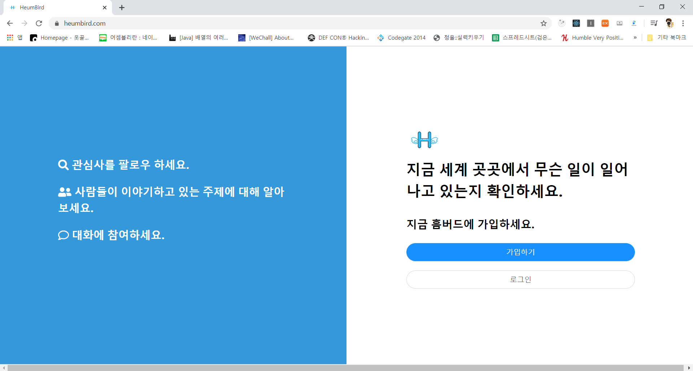
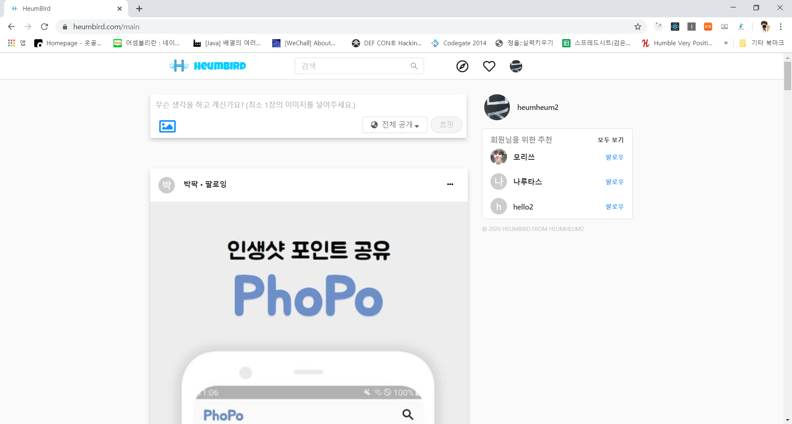

# HeumBird

> instagram과 Twitter를 참고하여 React로 만든 SNS입니다.

![NPM Version][npm-image]

## 사용 기술

- Framework & Library : React.js, Express.js, Next.js, Node.js, Sequelize
- Language : javaScript, css
- Database : Mysql
- Server : AWS ec2
- Storage : AWS S3

## 주요 기능

- 회원가입 / 로그인
- 게시물 권한
  - 전체 공개
  - 팔로우들만
  - 나만 보기
- 게시물 업로드 및 수정, 삭제
- 게시물 좋아요
- 팔로우, 팔로잉
- 팔로우 추천 기능

## 폴더 구조

- Front end

  - config : 배포 및 개발환경에 따른 주소
  - components : 재사용 컴포넌트
  - containers : dispatcher 컴포넌트
  - pages : 페이지
  - reducers : Middleware State
  - sagas : Middleware Async communication

- Back end

  - config : Sequelize 환경 설정
  - migrations : Database 변경
  - models : Database 테이블 생성 및 관계 설정
  - routes : REST API

- lambda : AWS lambda

## 정보

이메일 주소 - jwh6295@gmail.com

웹사이트 주소 - https://heumbird.com

영상 주소 - https://www.youtube.com/watch?v=ZkAq3NuiOVM

<!-- Markdown link & img dfn's -->

[npm-image]: https://img.shields.io/badge/npm-6.13.4-blue
